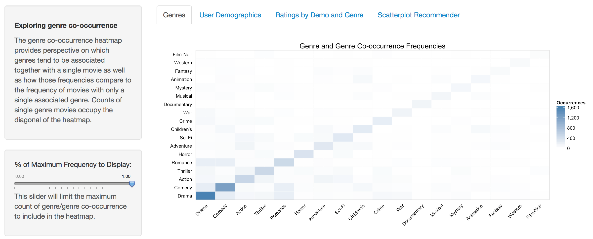
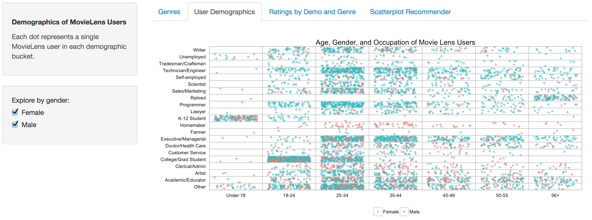

Final Project
==============================

| **Name**  | Jason Ament |
|----------:|:-------------|
| **Email** | jeament@dons.usfca.edu |

## MovieLens Dataset Exploration

My final proect consists of an exploration of the MovieLens 1M dataset, a set of 3 tables of data relating 1 million individual ratings by 6,000 users on 4,000 movies.  Full details and the dataset can be found [here.](http://grouplens.org/datasets/movielens/)

###Technique 1 - Heatmap###

 For the first technique, I wanted to explore and visualize the frequency of movie genres within the dataset.  Each movie could be tagged with one or more of 18 distinct genres, and I wanted the viewer to be able to understand which genres occurred the most frequently, both as single genres and as instances of co-occurrence with other genres.  The co-occurence heatmap seemed to be a good choice to convey this information.  
 
 To accomplish this effect, I encoded the data so that the movie data frame had columns for every single distinct genre.  I then looped through the dataset and searched for each single genre within the movie's complete genre descritpion, and if a single genre was present in the compelete genre column the matching single genre columns each receive a '1' to indicate presence of that genre.  Otherwise, the non-matching genres for that title received a '0'.  I therefore had a matrix of title and genres which I was able to use to create a co-occurence matrix by multiplying the genre matrix by itself, creating an 18 X 18 matrix with counts of individual genres on the diagonal and counts of co-occurences on the intersecting cells.
 
 The lie factor in the heatmap is present as the user may have difficulty knowing the exact number of occurrences based only on the color gradient.  This is somewhat unavoidable in a heatmap however.  The data density is fairly low, with signifigant portions of the plot displaying as white, especially when the slider is in default position and the full range of frequencies is being displayed in the plot.  The data to ink ratio is quite good - there is very little to distract the viewer from what he/she is meant to gleen from the plot. 
 
 This visualization excels at introducing the viewer to the various genres present in the dataset as well as the overall frequency of films with individual genres and the frequency of co-occurrence between genres.  The viewer can interact with the plot to easily discover that drama is the most frequent single genre in the dataset and that the most frequently co-occurring genres are drama/romance, drama/comedy, and romance/comedy.  The viewer can see how frequent children's/animation movies are compared to war/drama movies as well.  I was able to quickly understand the distribution of genres by visualing them with this heatmap and I'm proud of the final product!

###Technique 2 - Scatterplot ###

 For my second technique, I chose a scatterplot to display the count of users in the dataset by demographic profile.  Specifically, each user had an associated gender, age range, location, and occupation.  The interesting part of the scatterplot is that all of the variables are in essence categorical.  There are two genders, 7 age bands, and 21 occupations.  I struggled to find the best way to present this data.  In the end, I settled on the scatterplot with age band on the x axis, occupation on the y axis, and colored by gender, with heavy jitter and alpha to address the overalp issue.  The result is unique and interesting in my opinion.  
 
 The data is simply encoded as factors for gender, age bucket, and occupation.  There is certainly some lie factor here, since the age buckets vary in size and the jitter of the points seems to indicate consistent distributions of users across those age buckets.  For example, it would seem that there is a uniform count of users, both male and female, in every occupation across every year in each age band.   That is surely not the case. Given the dataset though this may be acceptable, since specific ages weren't provided for users. 
 
  The data density and data to ink ratio are excellent in this case, as each data point represents a single MovieLens user.  The density of the cells indicates the demographic profiles with the most users, and the alpha on the points allows the viewer to somewhat discern the balance of gender within each cell.  For added ability to explore these cells by gender, I included the ability to focus on a specific gender via a checkbox control.  This allows the viewer to look specifically at counts for each gender and allows the comparison between genders by toggling this checkbox.  I removed the legend and axes titles since I thought was already evident what these were. This improved the data to ink ratio.
  
  This visualization excels at giving the viewer insight into the demographic profiles of the MovieLens users.  Viewers can easily see which occupations have the most users, which age bands have the most users, and which intersections of occupation/age have the most users.  In addition all of this can be comprehended along with gender distribution as well. 
  
  I learned how the users of the datset were distributed within the demographic profiles.  Specifically, I discovered that there were more men than women in the dataset, and that the most highly represented demographic profile was college/grad students in the 18-24 year old age bucket, for both men and women.  Furthermore, most of the users aged under 18 were K-12 students, which made sense.  Most of the homemakers in the dataset were women aged 25-44, and most of the technical/engineering and executive/management users were men.  

###Technique 3 - Small Multiples ###

 For my third technique, I chose a small multiples plot with boxplots and facets.  This visualization presents the distributions of mean star ratings for individual films within each genre, by age, genre, and gender.  
 
 Encoding the data for this plot was quite involved.  

  * How you encoded the data
  * Evaluation of lie factor, data density, and data to ink ratio
  * What visualization excels at
  * What you learned about the dataset as a result

###Technique 4 - Bubble Plot ###

###Interactivity###

 All but one of my plots featured interactivity.  The heatmap, for example, allows the user to adjust a slider to set the maximum genre count to include in the heatmap color scale.  This way, the viewer can lop off the most frequently occurring genres, which become gray, and see how some of the less-frequently occurring and co-occurring genres match up in terms of frquency.  In this way, the user isn't faced with a static plot that masks the relationships of the lower-frequency genres but instead can explore the frequencies and get a true sense of how often certain genres occur in the dataset.
 
 The user demographic distribution scatterplot provided the user with the ability to filter the scatterplot by gender, so that the viewer could compare demographics across genders.  While the viewer could sort of see this without the filter due to the alpha and jitter in the plot, I think the addition of the filter makes this exploration even clearer.  It is much easier to see the count of men vs. women when one is able to competely remove one and then the other from the plot area.  
 
  * Type of interactivty
  * How it enhances visualiation

###Prototype Feedback###

 When I presented my rough genre co-occurence heatmap, I received quite a bit of helpful feedback.  For one, at the time the color scale I was trying to use involved a divergent color scheme.  I had thought that I would use this to 'white out' the middle values in the heatmp so that the higher and lower values would stand out more.  The nature of the dataset is that the single genre counts are significantly higher than the co-occurrence counts, so the higher end of the scale dominated the color gradient.  It was suggested that I use a gradient starting with white on the low end and darkening to a final color at the high end.  This was very helpful.
 
 One bit of feedback that I did not find helpful on the heatmap was a suggestion to start the diagonal at the upper left and set the tiles to be 1:1.  I considered this but decided against it.  For one, it appears that you cannot set the x axis labels on the top of a plot.  I liked that the dark diagonal starts at the lower left corner and that is where the two axes labels meet, so the viewer is drawn to a point of the most information.  From there, the viewer can proceed into the plot with knowledge of where they are in the genre list.  In addition, setting the ratio to 1:1 would have resulted in a squarish heatmap, which would not have filled the page well, and the genre labels would have become cramped.
 
 I received quite a bit of useful feedback on my user scatterplot.  Initially, the gridlines were still in place in my prototype.  As a result, each clump of points was centered around intersecting lines for the matching age/occuption at that point.  This led to confusion as it was somewhat hard to say exactly where each point fell on the axes.  In general, the feedback was positive on this plot however.  Several people commented on the uniqueness of the plot, and they thought it was a very interesting way to present this information.
 
 As a result of the feedback, I completely removed the gridlines in the plot and replaced them with manually set vertical and horizontal lines occuring precisely between every axis label location.  This took me quite a while to figure out, but when I was done I had created individual cells for each intersection that perfectly held the dots for each user. Any confusion about location for each user was gone!  The result is sort of a scatterplot heatmap, but it seems to work well.  
 
  * Description of prototype presented
  * Changes made based on feedback
  * Feedback you found helpful and why
  * Feedback you did not agree with and why

###Challenges###

 Once challenge I faced was that the genre occurence counts were very unbalanced.  For example, the most frequently occuring genre in the dataset was drama, which occurred much more frequently than film-noir.  As a result, I had to figure out a way to make the heatmap color diverse enough to be visually appealing and informative.  I played with a divergent color scheme and slider similar to what we did in class, hoping that by allowing the user to filter out large chunks of the data some of the interesting co-occuring cells would become more visible.  This did not work very well however, so I found that using a color gradient starting with white at the low end of the scale and giving the suer the ability to adjust the range with a slider worked much better.   This allows the user to explore the dataset and see the co-occuring genres pop out as the slider moves.  In generally, just creating the co-occurence matrix was a challenge as well, and it took me quite a while to work out the matrix math behind the scenes.
  * how you addressed
  * why you did not address
  * what would you have done with more time
