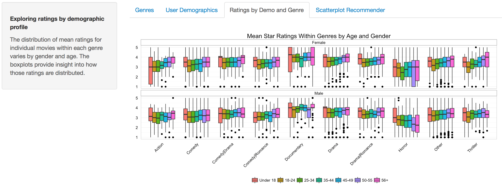
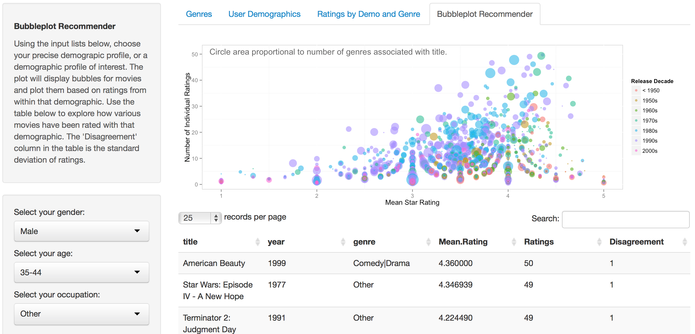

Final Project
==============================

| **Name**  | Jason Ament |
|----------:|:-------------|
| **Email** | jeament@dons.usfca.edu |

## MovieLens Dataset Exploration

My final proect consists of an exploration of the MovieLens 1M dataset, a set of 3 tables of data relating 1 million individual ratings by 6,000 users on 4,000 movies.  Full details and the dataset can be found [here.](http://grouplens.org/datasets/movielens/)

### Instructions ###

The following packages must be installed prior to running this code:

- `ggplot2`
- `shiny`
- `GGally`
- `grid`
- `reshape`
- `scales`

To run this code, please enter the following commands in R:

```
library(shiny)
shiny::runGitHub('msan622', 'coyotemojo', subdir='final-project')
```

This will start the `shiny` app. See below for details on how to interact with the visualization.


###Technique 1 - Heatmap###


 For the first technique, I wanted to explore and visualize the frequency of movie genres within the dataset.  Each movie could be tagged with one or more of 18 distinct genres, and I wanted the viewer to be able to understand which genres occurred the most frequently, both as single genres and as instances of co-occurrence with other genres.  The co-occurence heatmap seemed to be a good choice to convey this information.  
 
 To accomplish this effect, I encoded the data so that the movie data frame had columns for every single distinct genre.  I then looped through the dataset and searched for each single genre within the movie's complete genre descritpion, and if a single genre was present in the compelete genre column the matching single genre columns each receive a '1' to indicate presence of that genre.  Otherwise, the non-matching genres for that title received a '0'.  I therefore had a matrix of title and genres which I was able to use to create a co-occurence matrix by multiplying the genre matrix by itself, creating an 18 X 18 matrix with counts of individual genres on the diagonal and counts of co-occurences on the intersecting cells.
 
 The lie factor in the heatmap is present as the user may have difficulty knowing the exact number of occurrences based only on the color gradient.  This is somewhat unavoidable in a heatmap however.  The data density is fairly low, with signifigant portions of the plot displaying as white, especially when the slider is in default position and the full range of frequencies is being displayed in the plot.  The data to ink ratio is quite good - there is very little to distract the viewer from what he/she is meant to gleen from the plot. 
 
 This visualization excels at introducing the viewer to the various genres present in the dataset as well as the overall frequency of films with individual genres and the frequency of co-occurrence between genres.  The viewer can interact with the plot to easily discover that drama is the most frequent single genre in the dataset and that the most frequently co-occurring genres are drama/romance, drama/comedy, and romance/comedy.  The viewer can see how frequent children's/animation movies are compared to war/drama movies as well.  I was able to quickly understand the distribution of genres by visualing them with this heatmap and I'm proud of the final product!

###Technique 2 - Scatterplot ###


 For my second technique, I chose a scatterplot to display the count of users in the dataset by demographic profile.  Specifically, each user had an associated gender, age range, location, and occupation.  The interesting part of the scatterplot is that all of the variables are in essence categorical.  There are two genders, 7 age bands, and 21 occupations.  I struggled to find the best way to present this data.  In the end, I settled on the scatterplot with age band on the x axis, occupation on the y axis, and colored by gender, with heavy jitter and alpha to address the overalp issue.  The result is unique and interesting in my opinion.  
 
 The data is simply encoded as factors for gender, age bucket, and occupation.  There is certainly some lie factor here, since the age buckets vary in size and the jitter of the points seems to indicate consistent distributions of users across those age buckets.  For example, it would seem that there is a uniform count of users, both male and female, in every occupation across every year in each age band.   That is surely not the case. Given the dataset though this may be acceptable, since specific ages weren't provided for users. 
 
  The data density and data to ink ratio are excellent in this case, as each data point represents a single MovieLens user.  The density of the cells indicates the demographic profiles with the most users, and the alpha on the points allows the viewer to somewhat discern the balance of gender within each cell.  For added ability to explore these cells by gender, I included the ability to focus on a specific gender via a checkbox control.  This allows the viewer to look specifically at counts for each gender and allows the comparison between genders by toggling this checkbox.  I removed the legend and axes titles since I thought was already evident what these were. This improved the data to ink ratio.
  
  This visualization excels at giving the viewer insight into the demographic profiles of the MovieLens users.  Viewers can easily see which occupations have the most users, which age bands have the most users, and which intersections of occupation/age have the most users.  In addition all of this can be comprehended along with gender distribution as well. 
  
  I learned how the users of the datset were distributed within the demographic profiles.  Specifically, I discovered that there were more men than women in the dataset, and that the most highly represented demographic profile was college/grad students in the 18-24 year old age bucket, for both men and women.  Furthermore, most of the users aged under 18 were K-12 students, which made sense.  Most of the homemakers in the dataset were women aged 25-44, and most of the technical/engineering and executive/management users were men.  

###Technique 3 - Small Multiples ###



 For my third technique, I chose a small multiples plot with boxplots and facets.  This visualization presents the distributions of mean star ratings for individual films within each genre, by age, genre, and gender.  
 
 Encoding the data for this plot was quite involved.  I had to summarize the data within the movie ratings file, essentially calculating the average rating for each movie, by gender and by age.  So the data frame had a single row for every combination of gender and age band for every movie, along with an associated average rating.  In addition, since there were 18 genres, I decided to find the top 9 genres and bucket everything else into an "other" genre.  I felt that 9 total genres was a decent tradeoff between accurately displaying the variability of ratings among genres while keeping the number of genres manageable.  I know that it is challenging to exceed 6 or 7 specific categories as pre-attentive attributes, but I felt like that was just too few to fully capture the variety of movies in the dataset.  I certainly wanted to see ratings for all of the obviously well-known genres.

 As a result of the bucketing of movies into the 'other' genre when they're original genre wasn't in the top 9 most frequently occurring genres, there is some lie factor in the small multiples plot.  For example, all movies that had more than 2 genres originally fell into the 'other' bucket, since no combined genre made up of 3 or more genres was in the top 9 most frequently occurring genres. As a result, a drama/romance/thriller movie ends up in the 'other' bucket even though it might more accurately be considered similar to a  drama/romance movie.  
 
 The data density and data to ink ratio are very high in this plot. The ratings for movies across the visible genres, by gender and by age are all identifiable in this plot.  In my opinion, there is a ton of information available in this single visualization. 
 
  This visualization excels at giving the viewer perspective on how ratings tend to vary for particular genres across demographic profile.  The viewer can easily see how ratings for particular genres change across user age buckets.  In addition, the user can, with a little more difficulty, compare ratings within a genre across genders.  So it's possible to see how females tend to rate documentaries vs. males, by age.  Finally, it's easy to see how spread out those ratings are.  The boxplot excels at visualizing the median and range of a distribution.  All of that is readily apparent.
  
  In creating this visualization, I learned that in general the female raters in this dataset tended to rate movies higher across almost all genres.  I was also able to see that in general after the younges group, which tended to rate movies the highest, the older the rater, the higher the rating in most genres except for horror.  For horror movies older viewers tended to rate those movies lower.  Women tended to have wider ranges to their ratings.   Horror was the lowest rated genre while documentaries were the highest.
  
###Technique 4 - Bubble Plot ###



 For my final technique, I attempted to create a bubble plot that reflected the user's demographic selections on the seletions lists alongside the plot.  The bubble plot displays movies based on how many ratings they have received and the mean of those ratings, colored by the decade of release and sized by the number of genres associated with the movie.  The bubble plot allows the user to explore movies rated highly (or poorly!)  within his/her demographic group, and using the table below the plot the viewer can locate potential movies of interest.  
 
 There is quite a bit of fudging going on in this plot that contributes to a higher lie factor.  For one, there is jitter so that the points don't completely overplot each other.  This results in movies not lining up precisely with their associated values.  I think the data density is fairly high as I tried to pack as much information into the bubble plot as possible.  In addition, there isn't a ton of extra ink, although the addition of the datatable adds quite a bit of additional ink to the page.
 
###Interactivity###

 All but one of my plots featured interactivity.  The heatmap, for example, allows the user to adjust a slider to set the maximum genre count to include in the heatmap color scale.  This way, the viewer can lop off the most frequently occurring genres, which become gray, and see how some of the less-frequently occurring and co-occurring genres match up in terms of frquency.  In this way, the user isn't faced with a static plot that masks the relationships of the lower-frequency genres but instead can explore the frequencies and get a true sense of how often certain genres occur in the dataset.
 
 The user demographic distribution scatterplot provided the user with the ability to filter the scatterplot by gender, so that the viewer could compare demographics across genders.  While the viewer could sort of see this without the filter due to the alpha and jitter in the plot, I think the addition of the filter makes this exploration even clearer.  It is much easier to see the count of men vs. women when one is able to competely remove one and then the other from the plot area.  
 
  The vision for the bubbleplot recommender was to allow the user to select his/her demographic from a list and then see which movies were recommended based on the ratings of similar users.  Therefore, all ratings information displayed on the bubbleplot (number of ratings, average rating, standard deviation) are based exclusively on users within that particular demoagraphic.  The datatable can also be sorted so that the viewer can look for movies that are most/least highly rated, have the most ratings, have the most/least disagreement, etc.  

###Prototype Feedback###

 When I presented my rough genre co-occurence heatmap, I received quite a bit of helpful feedback.  For one, at the time the color scale I was trying to use involved a divergent color scheme.  I had thought that I would use this to 'white out' the middle values in the heatmp so that the higher and lower values would stand out more.  The nature of the dataset is that the single genre counts are significantly higher than the co-occurrence counts, so the higher end of the scale dominated the color gradient.  It was suggested that I use a gradient starting with white on the low end and darkening to a final color at the high end.  This was very helpful.
 
 One bit of feedback that I did not find helpful on the heatmap was a suggestion to start the diagonal at the upper left and set the tiles to be 1:1.  I considered this but decided against it.  For one, it appears that you cannot set the x axis labels on the top of a plot.  I liked that the dark diagonal starts at the lower left corner and that is where the two axes labels meet, so the viewer is drawn to a point of the most information.  From there, the viewer can proceed into the plot with knowledge of where they are in the genre list.  In addition, setting the ratio to 1:1 would have resulted in a squarish heatmap, which would not have filled the page well, and the genre labels would have become cramped.
 
 I received quite a bit of useful feedback on my user scatterplot.  Initially, the gridlines were still in place in my prototype.  As a result, each clump of points was centered around intersecting lines for the matching age/occuption at that point.  This led to confusion as it was somewhat hard to say exactly where each point fell on the axes.  In general, the feedback was positive on this plot however.  Several people commented on the uniqueness of the plot, and they thought it was a very interesting way to present this information.
 
 As a result of the feedback, I completely removed the gridlines in the plot and replaced them with manually set vertical and horizontal lines occuring precisely between every axis label location.  This took me quite a while to figure out, but when I was done I had created individual cells for each intersection that perfectly held the dots for each user. Any confusion about location for each user was gone!  The result is sort of a scatterplot heatmap, but it seems to work well.  
 
 I did not have a prototype of my small multiples avaiable for feedback, but I did have a user map that showed where in the U.S. the users were located.  This map was barely done however, so it didn't really generate much feedback other than some brainstorming on what to include in the plot.  In the end, I scrapped the map and decided to use a small multiples boxplot to visualize ratings by genre across demographic profile.
 
 I also did not really have a prototype of the bubble plot, but in general the feedback regarding the overall idea was fairly positive.  
 
###Challenges###

 One challenge I faced with the heatmap was that the genre occurence counts were very unbalanced.  For example, the most frequently occuring genre in the dataset was drama, which occurred much more frequently than film-noir.  As a result, I had to figure out a way to make the heatmap color diverse enough to be visually appealing and informative.  I played with a divergent color scheme and slider similar to what we did in class, hoping that by allowing the user to filter out large chunks of the data some of the interesting co-occuring cells would become more visible.  This did not work very well however, so I found that using a color gradient starting with white at the low end of the scale and giving the suer the ability to adjust the range with a slider worked much better.   This allows the user to explore the dataset and see the co-occuring genres pop out as the slider moves.  In generally, just creating the co-occurence matrix was a challenge as well, and it took me quite a while to work out the matrix math behind the scenes.
 
 For the scatterplot, I faced the challenge of getting rid of the confusion generated by the gridlines and location of the points around intersections of lines from the axes.  It wasn't perfectly clear which category each point was tied to, especially given the alpha and jitter I used to make the plot more legible.  What I finally discovered was that I could hide the gridlines and draw my own horizontal and vertical lines across the plot at defined intervals.  If I defined those intervals as being at half-steps along my axes, I ended up with lines that perfectly split the categories into 'cells' across the entire plot.  This turned out to work perfectly!  Each dot appears in the appropriate cell matching its x and y axis value, and the alpha and jitter both allow insight into overall count within the cell as well as gender density.  
 
 I struggled mightily with the small multiples plot to try to find a balance between too many plots and too many groupings and too few.  I looked at plotting just mean ratings for movies within each genre by gender only, and while that plot was much simpler, in my opinion it did not have enough data density to be truly effective.  Likeweise, I played with looking at average ratings by gender across each each band as well but I felt the same way about that plot - simply not enough variety to make it visually interesting.  I even toyed with providing the user with some sort of control so that he/she could visualize the ratings in various simple ways.  But finally I just decided that by limiting the number of genres to 10 and faeting the plots as I did the viewer could make comparisons of ratings across genres, ages, and genders all at once, and ultimately that is really what I wanted to enable to user to do.  I played with 'facet_grid' and 'facet_wrap' for hours to try to get the cleanest, most accessible view of the data and I think that's what I ended up with.
 
 With the bubble plot I had quite a few challenges trying to figure out what data I could map to the various aspects of the scatterplot.  There were too many genres I felt to map genre to color, as this would exceed the preattentive cognitive abilities of the viewer.  I didn't want to discard all of the genres just for the sake of having a nice number of colors to display either.  What I finally decided to do was calculate the total number of ratings (within the selected user group) for each title as well as the mean rating for that title within that group.  That gave me my x and y axes values.  But I still had to figure out what to map size and color to.  I tried various things, including calculating the standard deviation of the ratings as a measure of 'disagreement' or controversy and trying to map that to color.  But there just wasn't enough variation to see in the resulting plot.  Also, many of the movies don't have more than 1 ratings within a particular demographic group, so they didn't have a real standard deviation.
 
 Finally I decided to calculate the number of genres associated with each particular movie as a variable.  I mapped this to the size of the bubble.  I wanted to convey that as possibly an indication of complexity of the movie, since a movie with multiple genres associated with it might be somewhat more unique than a movie with only a single genre.  In addition, I cut the individual movie release years into categorical variables for decades to map to color in the bubble plot.  This provided the viewer with the abilit to match movies in the plot to the relative age of the movie by decade.  I thought this was a decent solution to the problem.
 
 If I had more time, I would have built out the functionality a little bit more on the bubble plot/recommendation engine.   What I really wanted to do was have the viewer select his/her demographic profile and rate a few representative movies, then use that information to create recommendations based on collaborative filtering techniques.  This might have allowed me to display some sort of clustering visualization showing the user where/how he/she related to the other users in the database.  

 I also would have liked to allowed the user to drill down into the bubble plot.  I think I could have used a overview bubble plot below the focus bubble plot, so that as the user drilled down into the plot (say by requiring more than 10 ratings and an > 4 average rating) the overview bubble plot could show a rectangle denoting where the detiail plot was focused, similar to what we did on the time series assignment.  Furthermore, once the user had identified a specific region of the bubble plot to 
 
 
 
 
 
 
 
 
