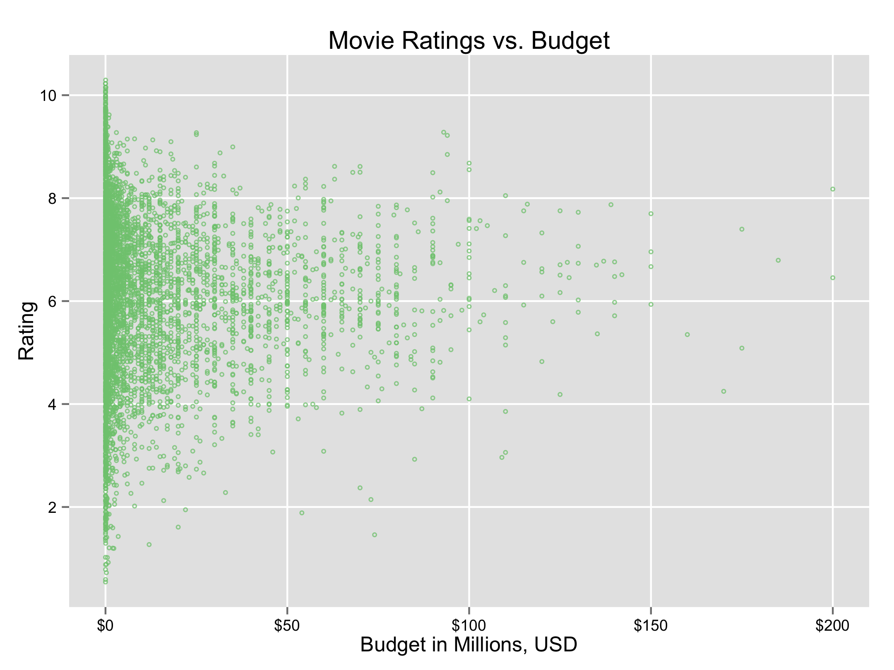
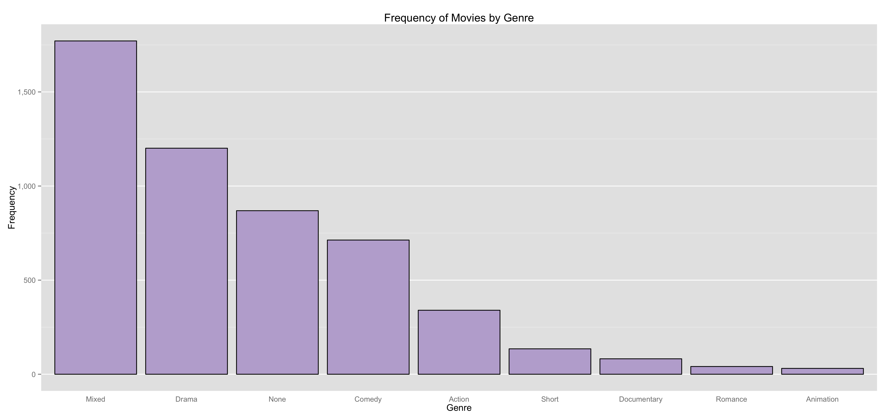
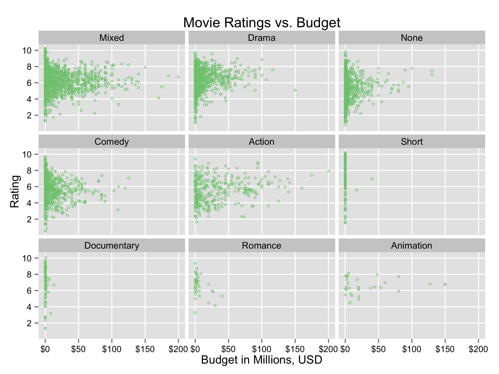
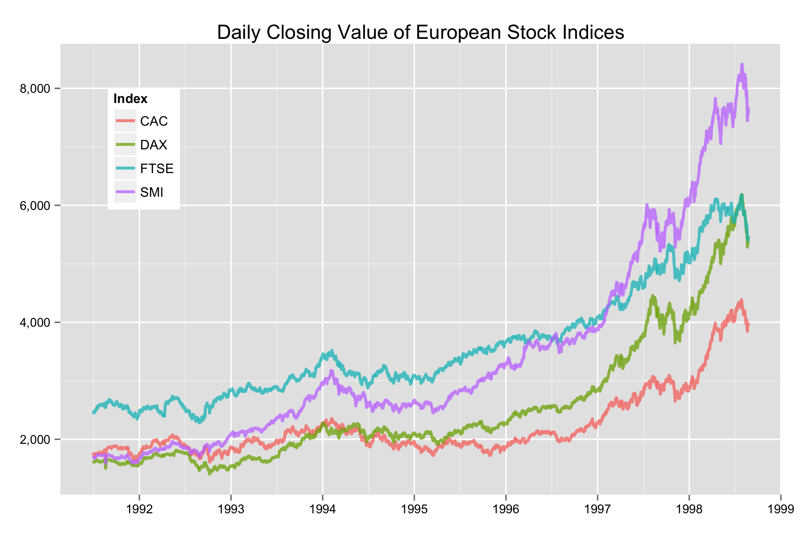

Homework 1: Basic Charts
==============================

Visualizations
------------------------------

You must create the following plots in a single `R` script:

- **Plot 1: Scatterplot.** Produce a scatterplot from the `movies` dataset in the `ggplot2` package, where `budget` is shown on the x-axis and `rating` is shown on the y-axis. Save the plot as `hw1-scatter.png`.

In the scatter plot I explored several parameters.  First, I noticed that many of the points overlap one another, so I played with the size of the point, the transparency of the point, jitter, and the shape of the point to make sure the viewer could see most of the locations of all points as well as wehre the points were the most dense.   I also investigated using a log scale on the x axis so that the points would be more spread out, but I decided that the benefit was not worth the congnitive effort required to understand the relationship of movie budget on the log scale.  I change the axis labels on both axes - for the x axis I reduced the budget to millions and for the y axis I set the labels to range from 2 to 10 in increments of 2 rather than the ggplot default of 2.5, 5, 7.5 and 10 because I thought the plot needed just a little more detail in that sense.  I also change the axis text font color to black for more visibility and I chose a color from a color brewer palette with the plan of using another color from the same palette for future plots in the assignment.

- **Plot 2: Bar Chart.** Count the number of action, adventure, etc. movies in the `genre` column of the `movies` dataset. Show the results as a bar chart, and save the chart as `hw1-bar.png`.

For the bar plot I first sorted the genres by decreasing counts so that the most frequent genre would show up on the left-hand side of the plot.  Then I set about removing as much 'chart junk' as possible, such as the axis titles, the x axis tick marks, and the x axis gridlines.  I also chose a complementary color from the same colorbrewer palette as the scatter plot above for all genres and decided against coloring each bar differently, since doing so wouldn't add any information to the plot.  I removed the padding at the bottom of the bars, and inally, I shrank the size of the axis label text so that the 'documentary' label wasn't so crowded by adjacent labels.  

- **Plot 3: Small Multiples.** Use the `genre` column in the `movies` dataset to generate a small-multiples scatterplot using the `facet_wrap()` function such that `budget` is shown on the x-axis and `rating` is shown on the y-axis. Save the plot as `hw1-multiples.png`.

For the small multiples plot, the main issue I faced was making sure the x axis labels weren't crowding eachother.  I adjusted those in the main scatter plot above so that the labels appeared clearly in the multiples plot.  Otherwise, I didn't change too much on the collection of small plots as I felt that I had addressed the most glaring needs of the scatterplot in the first scatterplot.

- **Plot 4: Multi-Line Chart.** Produce a multi-line chart from the `eu` dataset (created by transforming the `EuStockMarkets` dataset) with `time` shown on the x-axis and `price` on the y-axis. Draw one line for each index on the same chart. Save the plot as `hw1-multiline.png`.

For the multiline plot, I again removed both axis titles as I felt that they were redundant given the chart title.  I also again changed the axis label font colors to black and change the value on the y axis to comma format, and I change the breaks on the x axis so that only individual years from 1992 to 1999 were displayed.  The default line colors supplied by ggplot seemed appealing enough, so I left the alone.  I did however change the transparency and line sizes since the lines sometimes overlappe with eachother - I wanted all series to be visible and clearly identifiable by line color.  Finally, I moved the legend from the side of the plot onto the plot area, since there was a large open space on the left-hand side of the plot area. 

