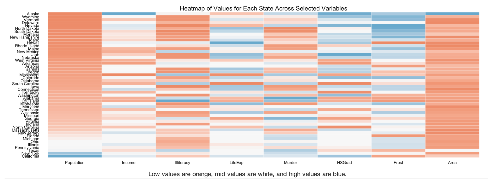
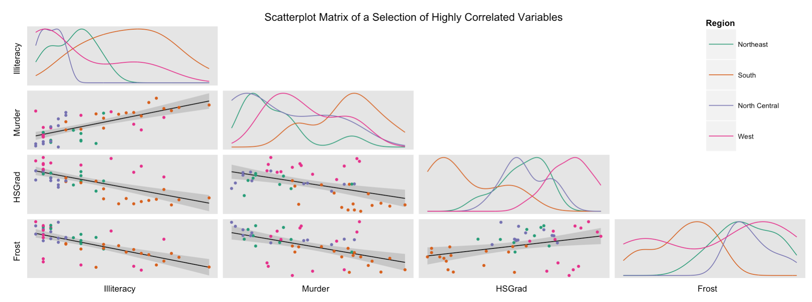
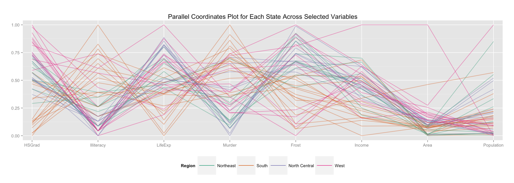
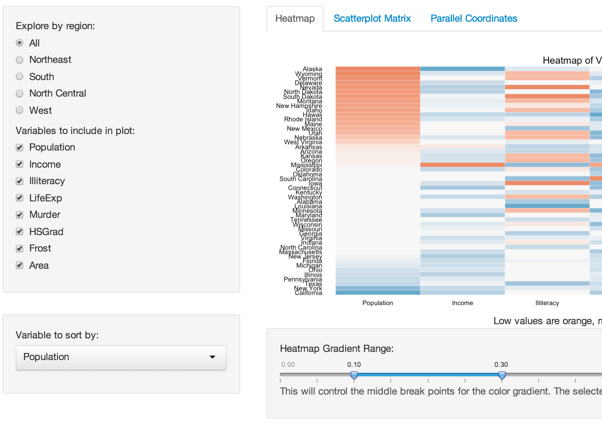

Homework 3: Multivariate Data Interactivity
==============================

| **Name**  | Jason Ament |
|----------:|:-------------|
| **Email** | jeament@dons.usfca.edu |

## Instructions ##

The following packages must be installed prior to running this code:

- `ggplot2`
- `shiny`
- `GGally`
- `grid`
- `reshape`
- `scales`

To run this code, please enter the following commands in R:

```
library(shiny)
shiny::runGitHub('msan622', 'coyotemojo', subdir='homework3')
```

This will start the `shiny` app. See below for details on how to interact with the visualization.

## Discussion ##

### Technique 1: Heatmap ###



I chose the heatmap because I had never created anything simlar to a heatmap before, and I thougth that Sophie's example in class was rather striking.  I chose to include all columns in the heatmap initially, but I allow the user to select which columns should be depicted, so if the user is interested in specific variables he/she can focus on those specifically and remove the ones of less interest.  In this case, the data is scaled by range, so in each column the state with the lowest value gets the most intense color for low values (orange in this case) and the state with the highest value gets the most intense color for the high values (blue in this case).

In terms of customization, I essentially removed all unnecessary markings, including tick marks and title, and used a minimal theme essentially similar to Sophie's example.  I also changed the color palette, and I flipped the coordinates since I felt it would be easier to read the individual state names if they were written horizontally.  I also decided to use the full state names instead of abbreviations since I felt that they were just easier to recognize.  

In terms of what the plot reveals in the data, the initial view includes all columns and all regions, with the states ordered from top to bottom in increasing order of population.  I think the heatmap has an interesting visual impact overall that draws the viewer in to start playing with the interactive portions.  Initially, the main impact is to see how few high-population states there actually are.


### Technique 2: Scatterplot Matrix ###



My second technique was the scatterplot matrix since I think this is an excellent tool for discovering underlying correlations within the data.  I felt that including all of the variables in this visualization would be overwhelming, so I examined the correlation matrix for the dataset and picked out what I felt were the most interesting highly correlated variables.  I colored the plots by region so that the viewer could get a sense of how the values for each variable changed by region.  I added the smoothing lines and confidence intervals so that the viewer could easily understand the apparent strength of the correlation between each pair of variables.  I also used my friend Manoj's technique for including a single legend in the plot since I felt that each plot did not need a legend, but the overall plot definitely needed one to indicate which region matched each color.  I also made sure to keep those colors consistent in the following plot on the next tab.

I think that the scatter plot matrix immediatley communicates some interesting relationships between days of frost, high school graduation rates, illiteracy rates, and murder rates.  One (possible!) interpretation of the scatter plot matrix could be that students in colder parts of the country stay indoors more, study more, and graduate at higher rates.  Furthermore, higher murder rates are correlated with low high school graduation rates and higher illiteracy rates.   

### Technique 3: Parallel Coordinates Plot ###



For the third technique, I chose the parallel coordinates plot mainly because I had to.  But I also wanted to use this technique because I had never done so (or really even recalled seeing it before).  For this plot, I again grouped the states by region (and maintained the same color associations from the scatter plot matrix).  I also included all variables by default as I felt it made a more striking visual impact, but I gave the viewer the ability to remove variables for easier explanation.  

I think the plot is an immediately striking plot that, similar to the heatmap, draws the user in for interaction.  As I provided the ability to highlight by region and add/remove variables, I think a viewer could spend some time exploring and learning about the characteristics of the various states.  

### Interactivity ###



I included quite a bit of interactivity in the plots.  First of all, I gave each plot its own tab, and I utilized conditional panels to adjust the available widgets depending on which tab the user selected.  So the interactivity varied a bit by plot but I did keep some of the settings of a few of the widgets consistent across the tabs.  Here is a list of interactive functions that I wove into the application:
 - Heatmap
   - The user can filter the heatmap by selecting a region (or all).  Only the states in that region will be displayed, but that selection will "follow" the viewer to the other tabs and also filter those plots by region in appropriate ways.
   - The viewer can decide which variables to included in the heatmap, and these filters apply to the parallel coordinates plot as well on the 3rd tab
   - The viewer can choose which column to use to sort the heatmap.  The column chosen as the sort column takes the leftmost position in the heatmap, allowing the user to immediately see how the states rank in that particular variable
   - The viwer can use the color sliders to decided how to filter how the middle values
 - Scatterplot Matrix
   - If the user has chosen a region, the scatter plot matrix will display only the data from that particular region, so the user can examine the distribution and correlation of each pair of variables within each region and across all regions if he/she so chooses.  This is a nice example of overview coupled with available detail.
 - Parallel Coordinates Plot
   - The viewer can again decide which variables to show on the plot, or if the viewer has already chosen a subset of variables on the heatmap, that choice will carry over to the parallel coordinates plot.
   - In terms of brushing, on the parallel coordinates plot if the user chooses a region, the states in that particular region will be drawn in a darker line while the lines of the other regions will fade into the background. This is a good  example of providing focus even while keeping the available context.
 
In general, I wanted the viewer to want to spend some time investigating how the states varied across any variables of interest.  
