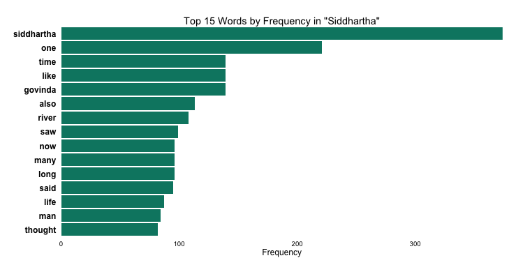
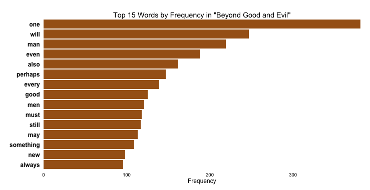
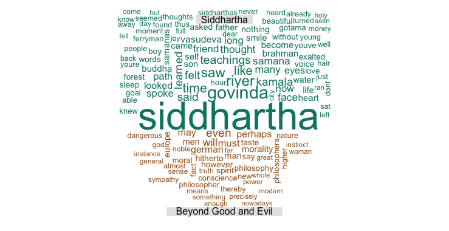
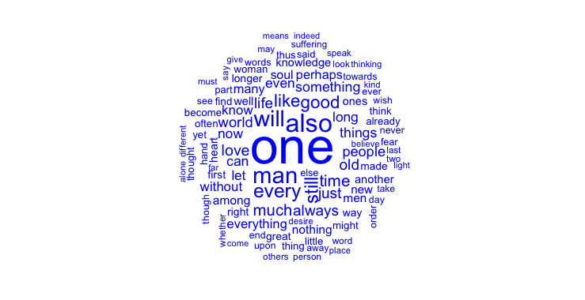

Homework 4: Text Visualization
==============================

| **Name**  | Jason Ament  |
|----------:|:-------------|
| **Email** | jeament@dons.usfca.edu |

## Instructions ##

- [`get_books.r`](get_books.r) loads the books, processes the text, and produces data frames for plotting
- [`plots.r`](plots.r) code to produce two sets of plots - two bar plots with the most frequent words in each text, a comparison word cloud and a commonality word cloud.

The load data code requires access to a local directory with the text of both books.

## Discussion ##

As I browsed the Project Gutenberg site, I latched on to the idea of comparing two contrasting texts - "Siddhartha" by Herman Hesse and "Beyond Good and Evil" by Friedrich Nietzsche.  The texts are similar in a few ways, namely that they both address the human experience and are both written by German authors, but they are also obviously different in that "Siddhartha" describes essentially a spiritual journey to knowledge of self while "Beyond Good and Evil" narrates a philosophical journey to knowledge of self.  I became curious as to how these two texts would appear under various text visualizations.

I started with a couple of top word frequency plots:

I played with the number of words to feature for both and decided that 15 words provided some interesting insight into some similarities and differences between the two texts.  I flipped the coordinates so that the words, which I bolded, would be easy to read for the viewer.  I also used two separate colors for the texts, and kept those color assigments consistent for the following comparison word cloud.  By default, the rotated bar plot would have place the most frequent words at the base of the y-axis, but I decided that I preferred to have the most frequent words at the top of the plot so that the viewer could easily allow his/her eye to flow from high frequency words at the top to lower frequency words at the bottom of the plot.  

I was pleasantly surprised by the way one can almost read the word from most frequent to least, top to bottom, and nearly pick up little sentences for each plot that somewhat expressed the essence of both works.  For example, the plot for "Siddhartha" displays "siddhartha-one-time-like-govinda," which sort of mirrors Siddhartha's journey from seeker (like Govinda) to enlightened one.  In contrast, the "Beyond Good and Evil" plot reveals "something-new-always," which reflects Nietzsche's belief that a philosopher (or seeker of self-fulfillment) must constantly seek out new situations for self-discovery.  

Following the frequency bar plots, I explored wordclouds, comparison clouds, and commonality clouds in the wordcloud package.  I eventually decided that pairing a comparison cloud with a commonality cloud would be an interesting way to visualize the two texts:

->Word Frequency Differences<-

->Word Frequency Simlarities<-

Phrase Net of Siddhartha (I like the 'and' Phrase Net)
http://www-958.ibm.com/software/analytics/labs/manyeyes/#vis=502929

Phrase Net of Beyond Good and Evil (I like the 'and' Phrase Net)
http://www-958.ibm.com/software/analytics/labs/manyeyes/#vis=502931

