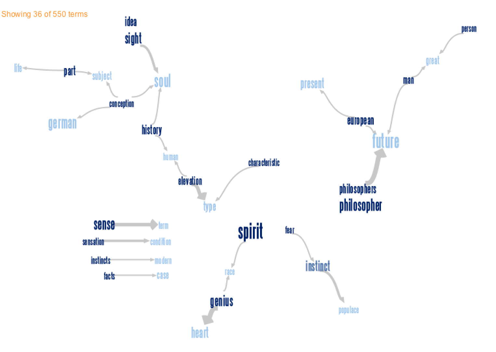

Homework 4: Text Visualization
==============================

| **Name**  | Jason Ament  |
|----------:|:-------------|
| **Email** | jeament@dons.usfca.edu |

## Instructions ##

- [`get_books.r`](get_books.r) loads the books, processes the text, and produces data frames for plotting
- [`plots.r`](plots.r) code to produce two sets of plots - two bar plots with the most frequent words in each text, a comparison word cloud and a commonality word cloud.

These packages are required to run the code above:
- `ggplot2`
- `tm`
- `SnowballC`
- `wordcloud`

The load data code requires access to a local directory with the text of both books.

## Discussion ##

As I browsed the Project Gutenberg site, I latched on to the idea of comparing two contrasting texts - "Siddhartha" by Herman Hesse and "Beyond Good and Evil" by Friedrich Nietzsche.  The texts are similar in a few ways, namely that they both address the human experience and are both written by German authors, but they are also obviously different in that "Siddhartha" describes essentially a spiritual journey to knowledge of self while "Beyond Good and Evil" narrates a philosophical journey to knowledge of self.  I became curious as to how these two texts would appear under various text visualizations.

I started with a couple of top word frequency plots:

I played with the number of words to feature for both and decided that 15 words provided some interesting insight into some similarities and differences between the two texts.  I flipped the coordinates so that the words, which I bolded, would be easy to read for the viewer.  I also used two separate colors for the texts, and kept those color assigments consistent for the following comparison word cloud.  By default, the rotated bar plot would have place the most frequent words at the base of the y-axis, but I decided that I preferred to have the most frequent words at the top of the plot so that the viewer could easily allow his/her eye to flow from high frequency words at the top to lower frequency words at the bottom of the plot.  

I was pleasantly surprised by the way one can almost read the word from most frequent to least, top to bottom, and nearly pick up little sentences for each plot that somewhat expressed the essence of both works.  For example, the plot for "Siddhartha" displays "siddhartha-one-time-like-govinda," which sort of mirrors Siddhartha's journey from seeker (like Govinda) to enlightened one.  In contrast, the "Beyond Good and Evil" plot reveals "something-new-always," which reflects Nietzsche's belief that a philosopher (or seeker of self-fulfillment) must constantly seek out new situations for self-discovery.  

Following the frequency bar plots, I explored wordclouds, comparison clouds, and commonality clouds in the wordcloud package.  I eventually decided that pairing a comparison cloud with a commonality cloud would be an interesting way to visualize the two texts:

###Word Frequency Differences###

###Word Frequency Similarities###

I want to mention that at this point I noticed that there were quite a few word stems present in the cloud, and I felt that they were sort of distracting.  I playe with the idea of replacing the stems with a close, full word (ie "philosophi" could be replaced by "philosophy") but I decided that this would introduce more lie factor then necessary since the frequencies for each word would no longer be strictly accurate.  In the end, I decided to not stem the texts and just live with some duplication of similar words in the clouds as I felt this provided a truer view of the actual texts.

There aren't too many possible customizations that can be made in the wordcloud package that I could find.  For example, I might have preferred to remove the titles in the comparison cloud simply because the prominence of the word "siddhartha" makes clear which part of the cloud refers to "Siddhartha."  I did decide to make the title text relatively small as it was almost superfluous.  

I was able to select colors for the cloud, so I chose two divergent colors from colorbrewer.  I wanted the colors to both be dark and bold but as divergent as possible.  I also liked mapping the more earthy, heartfelt "Siddhartha" to dark green and placing it on top while mapping the more cerebral "Beyond Good and Evil" to dark brown and placing its cloud on the bottom.   To me, the result suggested the leaves of a tree sitting on top of a trunk, which I tought was a pretty neat metaphor for the the different messages of the two texts.  

Finally, I chose dark blue for the common frequency word cloud and was again pleasantly surprised by the central "one" given that the commonality cloud is a unity of both texts.  

Lastly, I explored the Many Eyes tool to produce Phrase Nets for both texts:

###Phrase Net of Siddhartha###

http://www-958.ibm.com/software/analytics/labs/manyeyes/#vis=502929

###Phrase Net of Beyond Good and Evil###

http://www-958.ibm.com/software/analytics/labs/manyeyes/#vis=502931

I enjoyed playing around with the Many Eyes tool and seeing which of the phrase relationships produced the most interesting visualizations for each text.  In the end, I decided that the "x the y" relation produced the most visually and conceptually interesting graph for "Siddhartha."  I especially liked that several key phrases, such as "heard the teachings," "reached the nirvana," and "overcame the suffering" were immediately visible as I felt that those were central themes in teh book.

In contrast, I chose the "x of the y" relation for the "Beyond Good and Evil" graph.  That choice revealed "philosophers of the future," "elevation of the human," and "fear of the instinct/instinct of the populace."  All of these I thought truly presented a sense of what Nietzsche's work was all about.   

