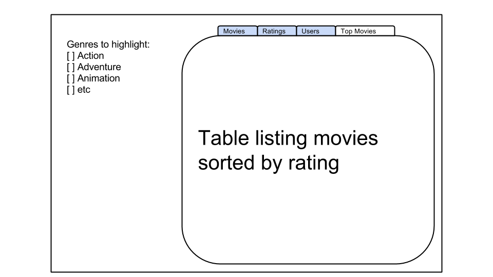
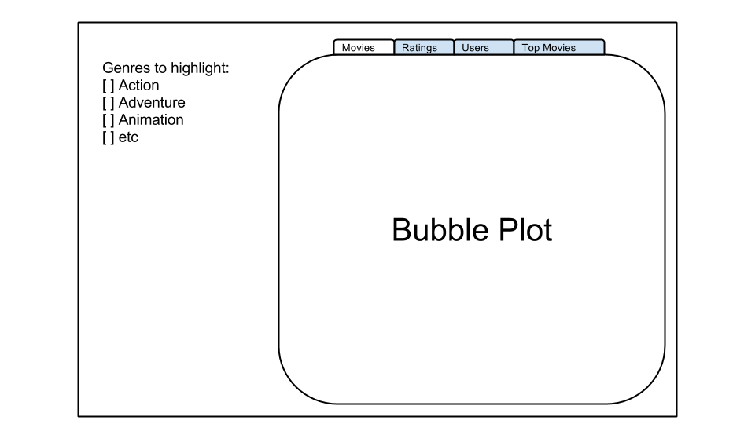
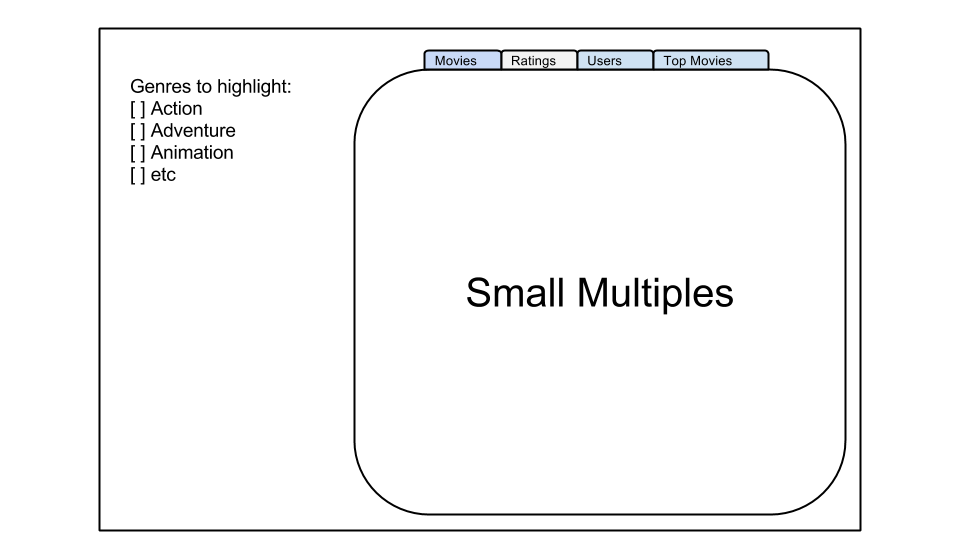
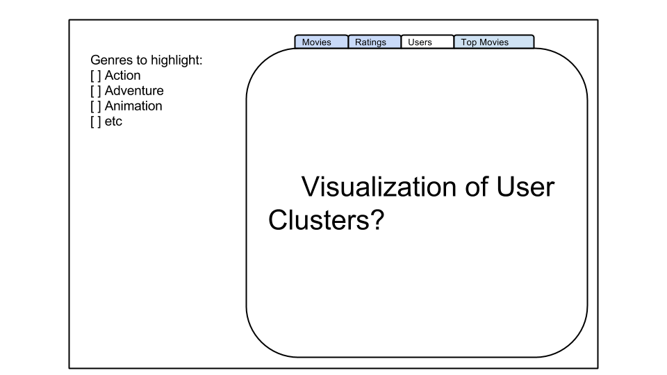

Project: Sketch
==============================

| **Name**  | Jason Ament |
|----------:|:-------------|
| **Email** | jeament@dons.usfca.edu |

## Discussion ##

For my project I will be visualizing a datset called MovieLens 1m, available here:
http://grouplens.org/datasets/movielens/.

The dataset consists of three files, over 1 million movie ratings by over 6 thousand users on over 4 thousand distinct movies.  I'm interested in conveying a general sense of the dataset as well as discovering the relationships between various types of users and movies.  

In terms of tools, I expect to use R, shiny, ggplot, and GGally.  I'm also likely to explore producing a map using Tableau and possibly two network visualizations, one showing clusters of movies and the other displaying clusters of users.

In terms of techniques, I'm thinking I'll have the following plots (with techniques discussed for each):
- Scatter plot: the bubble plot will have the number of users rating the movie on the x axis and the average star rating for the movie on the y axis. The user will be able to brush points by genre using a checkbox within the Shiny ui.  This should reveal how movies average rating varies by the number of ratings.  Are more frequently rated movies generally higher or lower rated?  How does that vary by genre?  Those are the questions I hope to shed light on with the scatter plot.
- Scatter plot matrix: the scatter plot matrix will visualize the distribution of star ratings by age bucket and gender.  This will allow the viewer to easily see how various demographic buckets tend to rate movies.   Are women more forgiving or harsher critics?  Or are men?  Furthermore, the plots will be filterable by genre, so the viewer can examine the difference in rating distrubution by genre.  Again, this should help the viewer tease out affinities for genres within demographic groups.  
- Heatmap: the heatmap will provide a view of how different age buckets rate various generes of movies.  The genres will be on the y axis while the demographic buckets will be on the x axis.  The heatmap color gradient will be mapped to the overall average rating of that genre by users in that age bucket.  The viewer will be able to sort the demographic buckets in order of highest average rating to lowest in order to get a further sense of how different age buckets tend to feel about movies of specific genres.  
- Cluster visualizations: I would like to be able to cluster users and movies into distinct groups based on various available attributes, and I would then like to be able to visualize those clusters.  At the moment I unsure of how to best do this since I'm unsure of what kinds of clusters will present themselves.  In theory, I could be able to identify 5 distinct 'types' of movie, which I could then offer as filters for the user to turn on and off.

Interface images:

